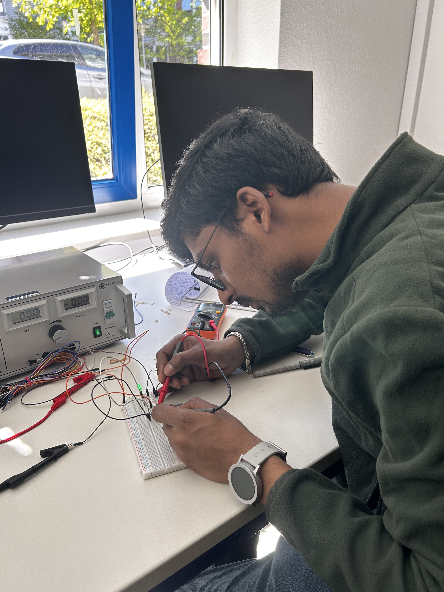
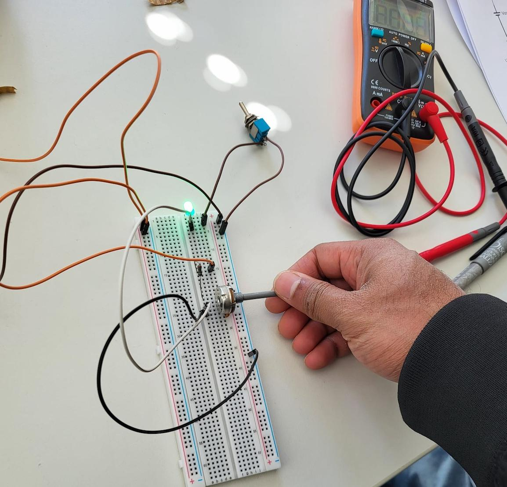
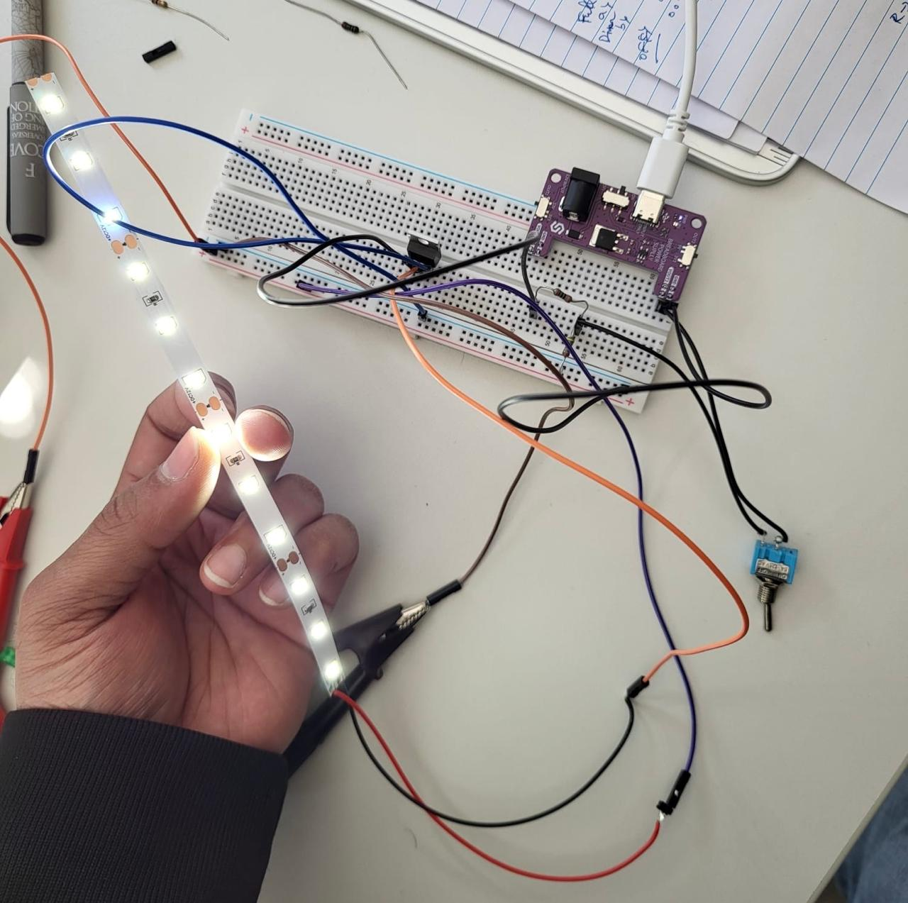
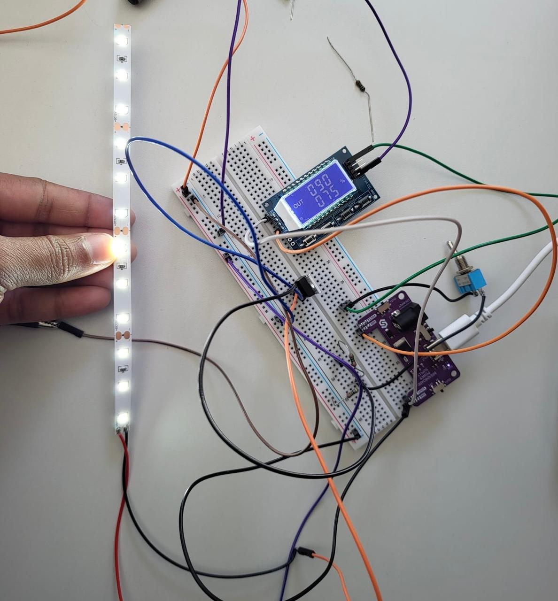

# Exercise 1 — Electrical Circuits

## Overview

This exercise introduced the fundamentals of electrical circuits through practical experimentation using breadboards, LEDs, resistors, switches, potentiometers, and MOSFET transistors. The objective was to understand how current flows through electrical circuits and how different electronic components influence voltage, resistance, and LED behaviour in practical systems.

Since this was my first hands-on electronics exercise, assembling the circuits and understanding breadboard connections initially felt unfamiliar. Through building and testing different circuit configurations, I gradually understood how resistors regulate current, how switches control circuit flow, and how potentiometers can be used to vary LED brightness.

The exercise also introduced transistor-based LED control circuits and brightness control techniques using PWM (Pulse Width Modulation). By experimenting with different circuit configurations, I explored how electronic components can be used to control LED behaviour under different operating conditions.

Throughout the exercise, circuits were assembled, measured, tested, and debugged using a breadboard and multimeter. The following sections document the assembly process, measurements, observations, and reflections for each task.

 

---

# Task 1 — LED Control Circuits

This task focused on building and analysing LED control circuits using basic electronic components and breadboard prototyping techniques. Through the subtasks, the circuit was progressively modified by introducing a switch and a potentiometer in order to explore different methods of controlling LED behaviour and brightness.

The task also involved observing voltage behaviour across circuit components and measuring electrical values using a multimeter to better understand the relationship between resistance, current flow, and LED operation.

## Components Required

- Resistors: 100 Ω, 220 Ω, 1.0 kΩ, 4.7 kΩ
- Green LED
- 1 kΩ potentiometer
- 2-position switch
- Breadboard
- Set of male-male jumper wires

---

 

## Task 1.1 — Simple LED Circuit

### Objective

The objective of this task was to build a simple LED circuit and observe how different resistor values affect the behaviour of the LED. This task also introduced the basics of breadboard connections, current flow, voltage measurements, and practical circuit assembly.

### Circuit Assembly

For this task, a simple series circuit was assembled using a green LED, resistors, a breadboard, jumper wires, and a 5V power supply. Since this was my first hands-on experience working with electrical circuits and breadboard prototyping, understanding the placement of components and circuit connections initially required careful observation and experimentation.

After assembling the circuit according to the schematic, the voltage across the resistor and LED was measured using a multimeter. The resistor value was then changed to observe how resistance affects LED brightness and voltage behaviour within the circuit.

 

  

  <em>Figure 1: Testing the simple LED circuit using a multimeter.</em>

 

### Measurements

| Resistor R1 (Ω) | Measured V1 (V) | Measured VLED (V) |
|---|---|---|
| 220 | 2.10V| 2.76V |
| 1000 | 2.53V | 2.45V |
| 4700 | 2.71V | 2.29V|

### Observations

The LED successfully turned ON after completing the circuit connections. While testing different resistor values, it was observed that increasing the resistance reduced the brightness of the LED. This occurred because higher resistance limits the amount of current flowing through the circuit.

The voltage across the resistor changed with different resistance values, while the LED voltage remained comparatively stable. Through these measurements, the relationship between resistance, voltage, and LED behaviour became easier to understand practically rather than only theoretically.

This task also helped me become familiar with using a multimeter to measure voltage and test electrical connections during circuit assembly.

### Reflection

As this was my first practical electronics experiment, this task provided a clear introduction to breadboard prototyping and electrical circuit behaviour. It also helped me understand how resistors protect LEDs by limiting current flow and how small changes in circuit configuration can affect component behaviour.

---
 

## Task 1.2 — Switchable LED Circuit

### Objective

The objective of this task was to extend the previous LED circuit by introducing a switch in order to control the flow of current within the circuit. This task focused on understanding how switches are used to open and close electrical circuits and how this affects LED behaviour.

### Circuit Assembly

The circuit was assembled according to the provided schematic by integrating a 2-position switch into the LED circuit. The switch was connected in series with the LED and resistor to control the continuity of the circuit.

During the assembly process, the behaviour of the LED was observed while toggling the switch between ON and OFF states. The circuit was also tested by reversing the switch orientation to understand whether the switch direction affects circuit operation.

 

  <video width="300" height="400" controls>
    <source src="videos/task1-switch-demo.mp4" type="video/mp4">
  </video>

  <em>Video 1: Demonstration of the switchable LED circuit and LED behaviour during switching.</em>

 

### Observations

When the switch was closed, the circuit became complete and the LED turned ON. When the switch was opened, the circuit path was interrupted and the LED turned OFF. This demonstrated how switches control the flow of current within an electrical circuit.

It was also observed that reversing the switch orientation did not affect the functionality of the circuit, since the switch simply acts as a mechanical connection for opening and closing the circuit path.

Through this task, the relationship between circuit continuity and component behaviour became easier to understand practically.

### Reflection

This task provided a practical understanding of how switches are used in electrical systems to control circuit operation. It also reinforced the fundamentals of current flow, circuit continuity, and breadboard-based circuit assembly through direct experimentation and observation.

---
 

## Task 1.3 — Dimmable LED Circuit

### Objective

The objective of this task was to control the brightness of the LED using a potentiometer and observe how variable resistance affects voltage behaviour and LED intensity within the circuit.

### Circuit Assembly

In this task, the previous LED circuit was extended by integrating a 1 kΩ potentiometer into the circuit. The potentiometer was connected according to the provided schematic, where the middle pin acted as the wiper and provided a variable output voltage.

While assembling the circuit, careful attention was required to correctly connect the potentiometer pins and understand how the variable resistance changes the behaviour of the LED. After assembling the circuit, the potentiometer was rotated gradually to observe changes in LED brightness and voltage measurements.

 

  

  <em>Figure 2: Testing the dimmable LED circuit using a potentiometer.</em>

 

### Measurements

| LED Position | Measured VLED (V) | Measured V2 (V) |
|---|---|---|
| Full Brightness | 2.97V | 2.99V |
| Dimmed | 2.88V | 4.55V |
| OFF | 0.37V | 4.58V |

### Observations

While rotating the potentiometer, the brightness of the LED changed gradually from fully bright to dim and eventually turned OFF. This behaviour demonstrated how variable resistance affects the current flowing through the LED circuit.

It was observed that increasing the resistance reduced the current flow and decreased the LED brightness. The voltage measurements also changed according to the potentiometer position, showing the relationship between resistance, voltage distribution, and LED behaviour within the circuit.

This task also provided practical understanding of how potentiometers are used for analog-style control in electronic systems.

 

  <video width="300" height="400" controls>
    <source src="videos/task1.3-potentiometer-demo.mp4" type="video/mp4">
  </video>

  <em>Video 2: Demonstration of LED brightness control using the potentiometer.</em>

 

### Reflection

This task provided practical experience in controlling circuit behaviour using variable resistance. It also improved my understanding of potentiometers, voltage regulation, and analog control mechanisms through direct experimentation and observation.

 

---

# Task 2 — Transistor Switch Circuit

This task focused on controlling an LED strip using an N-channel MOSFET transistor and PWM (Pulse Width Modulation) techniques. The objective of the task was to understand how transistors can be used as electronic switches and how PWM signals can be used to control the brightness behaviour of LEDs.

The task was divided into two subtasks that explored transistor-based switching and LED strip dimming using PWM signals. Through these subtasks, the relationship between switching frequency, duty cycle, and perceived LED brightness was observed and analysed under different circuit configurations.

The task also introduced the practical usage of MOSFET transistors, PWM signal generators, and external power supplies while understanding the role of common ground connections in electronic systems.

## Components Required

- Resistors: 100 Ω, 10 kΩ
- PWM Signal Generator + cable
- Power-supply USB module
- NPN MOSFET IRLZ44N
- 2-position switch
- 12V LED Strip
- Breadboard
- Set of male-male jumper wires
- Few male-female jumper wires

---

 

## Task 2.1 — Switchable LED Strip

### Objective

The objective of this task was to understand the working principle of an N-channel MOSFET transistor as an electronic switch for controlling a 12V LED strip. The task focused on observing how a low-voltage control signal can be used to switch a higher-power circuit ON and OFF.

### Circuit Assembly

The circuit was assembled according to the provided schematic using the IRLZ44N MOSFET transistor, resistors, a 12V LED strip, a switch, and external power supplies. Unlike the previous LED circuits, this setup introduced transistor-based switching and required careful attention to transistor pin configuration and common ground connections.

The gate terminal of the MOSFET was connected to the 5V control side through the switch, while the drain and source terminals controlled the 12V LED strip circuit. During assembly, understanding the transistor terminals and overall current flow initially required troubleshooting and careful observation before the circuit operated correctly.

 

  

  <em>Figure 3: Testing the MOSFET-based switchable LED strip circuit.</em>

 

### Observations

When the switch was turned ON, the LED strip turned ON, and when the switch was turned OFF, the LED strip turned OFF. Through this behaviour, it was observed that the switch was controlling the gate voltage (VGS) of the MOSFET transistor rather than directly controlling the 12V LED strip itself.

The 5V control signal applied to the gate terminal allowed the MOSFET to conduct current between the drain and source terminals, which powered the LED strip using the 12V supply. Removing the gate voltage stopped the current flow and turned the LED strip OFF.

This task demonstrated how a low-voltage control signal can be used to control a higher-power circuit using a transistor switch. It also highlighted the importance of proper grounding and correct transistor connections during circuit assembly.

Initially, identifying the transistor terminals and understanding the current flow required careful testing and troubleshooting before the circuit functioned correctly.

 

  <video width="300" height="400" controls>
    <source src="videos/task2.1-switchable-led-strip.mp4" type="video/mp4">
  </video>

  <em>Video 3: Demonstration of the MOSFET-based LED strip switching behaviour.</em>

 

### Reflection

This task provided practical experience with transistor-based switching circuits and improved my understanding of how MOSFETs can be used to control higher-power electronic devices using low-voltage control signals.

---
 

## Task 2.2 — Dimmable LED Strip using PWM

### Objective

The objective of this task was to understand how Pulse Width Modulation (PWM) can be used to control the brightness of an LED strip using an N-channel MOSFET transistor. This task focused on observing how duty cycle and switching frequency affect the visual behaviour of the LED strip.

---

## Circuit Assembly

The circuit was assembled according to the provided schematic using the IRLZ44N MOSFET transistor, PWM signal generator, resistors, LED strip, and external power supply. Compared to the previous tasks, this setup introduced PWM-based brightness control instead of simple ON/OFF switching.

The PWM generator was connected to the MOSFET gate terminal to provide a switching signal at different duty cycles and frequencies. The LED strip was powered using the 12V supply while the PWM generator operated from the 5V USB power board.

Understanding the PWM generator connections and configuring the correct frequency and duty cycle settings initially required careful setup and troubleshooting before the circuit functioned properly.

---

### Part A — Duty Cycle Observation

The PWM generator frequency was fixed at **90 Hz**, while different duty cycle values were tested to observe changes in LED strip brightness.

 

  

  <em>Figure 4: LED strip behaviour observed at 75% duty cycle with a PWM frequency of 90 Hz.</em>

 

### Duty Cycle Observations

| Duty Cycle (D) | LED Strip Behaviour |
|---|---|
| 2% | LED strip was barely visible and appeared almost OFF |
| 15% | LED strip produced very low brightness |
| 40% | Medium brightness was observed |
| 75% | LED strip appeared bright and stable |
| 100% | LED strip reached maximum brightness |

### Observations

It was observed that increasing the duty cycle gradually increased the brightness of the LED strip. At lower duty cycles, the LED remained ON for only a short portion of each switching cycle, resulting in lower visible brightness. As the duty cycle increased, the LED stayed ON for a longer duration, making the strip appear brighter.

Compared to the dimmable LED circuit from Task 1.3, brightness control using PWM appeared smoother and more efficient because the LED strip was rapidly switching between ON and OFF states rather than reducing voltage directly through resistance.

This task demonstrated how PWM can efficiently control brightness by adjusting the ON and OFF time ratio of the signal.

---

 

### Part B — Frequency Observation

The duty cycle was fixed at **50%**, while different PWM frequencies were tested to observe the switching behaviour of the LED strip.

### Frequency Observations

| Frequency (f) | LED Strip Behaviour |
|---|---|
| 5 Hz | Visible blinking was clearly observed |
| 25 Hz | Blinking became faster but still noticeable |
| 45 Hz | Flickering reduced significantly |
| 100 Hz | LED strip appeared stable with almost no visible flickering |

### Observations

It was observed that lower switching frequencies caused visible blinking because the LED strip switched ON and OFF slowly enough for the human eye to notice the changes. As the frequency increased, the switching became too fast to detect visually, making the LED strip appear continuously ON.

At higher frequencies, the flickering effect almost disappeared completely, demonstrating how PWM frequency affects perceived light stability.

This experiment helped in understanding the relationship between switching frequency and human visual perception in PWM-controlled systems.

 
<table align="center">
<tr>

<td align="center">
  <video width="180" controls>
    <source src="videos/frequency-5hz.mp4" type="video/mp4">
  </video>
   
  <strong>5 Hz</strong>
</td>

<td align="center">
  <video width="180" controls>
    <source src="videos/frequency-25hz.mp4" type="video/mp4">
  </video>
   
  <strong>25 Hz</strong>
</td>

<td align="center">
  <video width="180" controls>
    <source src="videos/frequency-45hz.mp4" type="video/mp4">
  </video>
   
  <strong>45 Hz</strong>
</td>

<td align="center">
  <video width="180" controls>
    <source src="videos/frequency-100hz.mp4" type="video/mp4">
  </video>
   
  <strong>100 Hz</strong>
</td>

</tr>
</table>

  <em>
    Video 4: Observation of LED strip behaviour at different PWM switching frequencies. 
    Lower frequencies produced visible blinking, while higher frequencies resulted in smoother and more stable illumination.
  </em>

 

---

### Reflection

This task provided practical understanding of PWM-based brightness control using MOSFET switching circuits. Through experimentation with duty cycle and switching frequency, I understood how PWM signals can control LED brightness efficiently while also influencing flickering behaviour and visual stability.

The task also improved my understanding of transistor switching, PWM control signals, and practical circuit debugging during hardware assembly.

---

 
 

# Conclusion and Reflection

This exercise was my first practical experience working with electrical circuits, breadboards, and electronic components. At the beginning, understanding the breadboard connections, resistor placements, transistor terminals, and overall current flow felt unfamiliar and slightly challenging. However, through assembling the circuits step-by-step and repeatedly testing different configurations, I gradually became more comfortable with analysing and debugging electronic circuits.

One of the most interesting parts of the exercise was observing how small changes in resistance, switching behaviour, duty cycle, and frequency directly affected the behaviour of the LEDs and LED strip. Testing the circuits using a multimeter also helped me better understand voltage distribution and current flow in practical systems rather than only theoretically.

The transistor switching and PWM tasks were especially useful in understanding how low-voltage control signals can operate higher-power devices and how PWM can efficiently control brightness behaviour. Troubleshooting incorrect connections and adjusting the circuit configurations also helped me improve my practical understanding of electronic prototyping and breadboard-based circuit assembly.

Overall, this exercise provided a strong introduction to practical electronics and helped me gain confidence in building, testing, and analysing electrical circuits through hands-on experimentation.