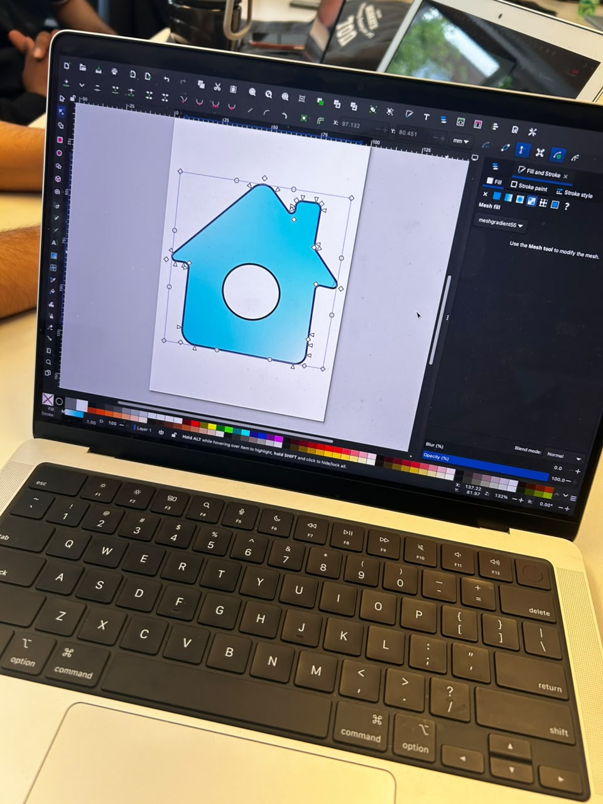
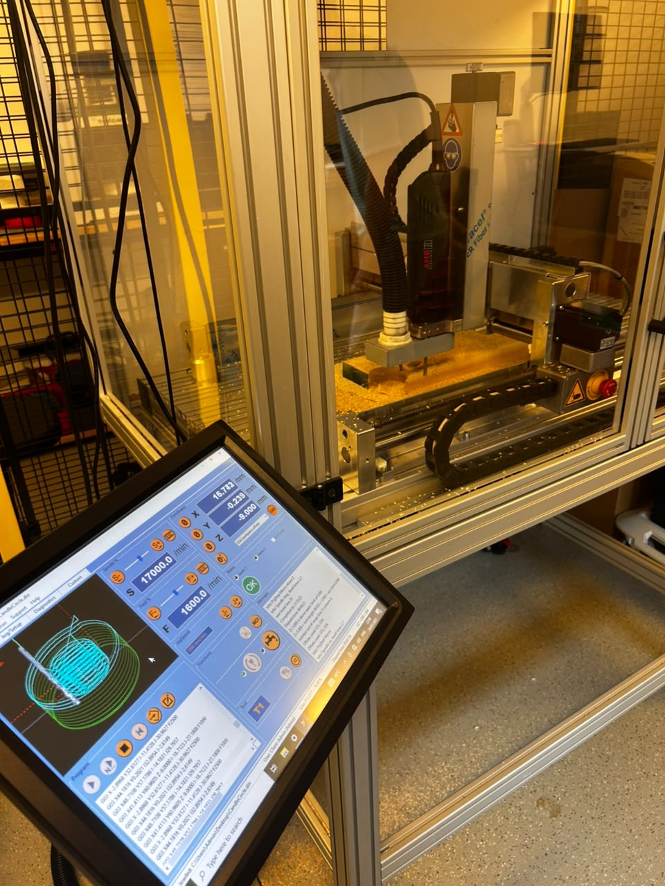
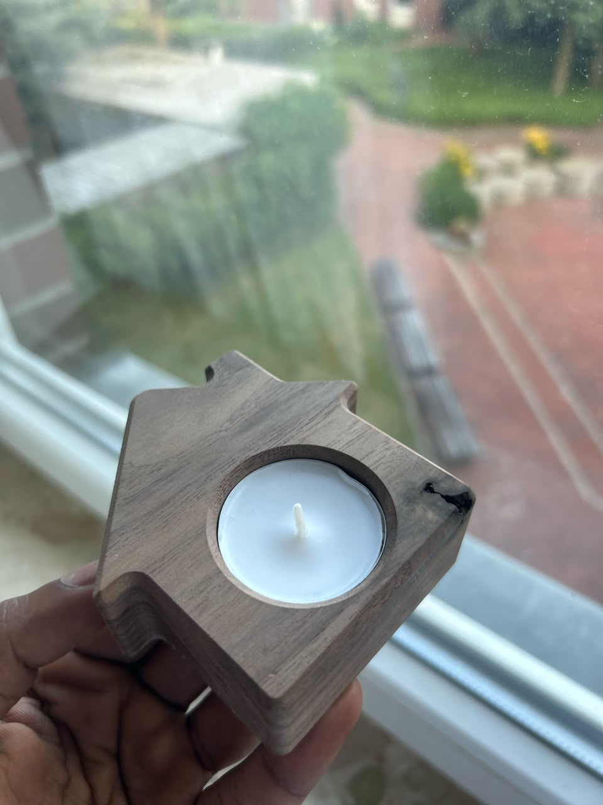

# Exercise 08: CNC Milling – Wooden Candle Holder

## Overview

This exercise gave me my first practical experience with CNC milling and the complete workflow of digital fabrication. Rather than simply learning the theory, I experienced how a design progresses from a digital drawing to a finished wooden product.

The exercise began with a laboratory workshop where the professor demonstrated the CNC milling machine and explained how the software, machine settings, and machining process work together to manufacture a product. Observing the complete workflow before starting my own design helped me understand what would be expected during the design stage and how important accurate dimensions are for successful machining.

Following the workshop, I designed my own candle holder in Inkscape by following the requirements provided in the exercise manual. After the design was reviewed and approved, it was manufactured using the CNC milling machine. A few days later, I received the finished wooden candle holder, allowing me to compare my original digital design with the final manufactured product.

---

## Design Process

For this exercise, I decided to create a simple house-shaped candle holder. I wanted a design that was easy to construct while still producing a clean and visually appealing wooden product after machining.

While creating the design in Inkscape, I carefully followed the dimensions specified in the exercise manual, including the overall design size of **95.5 mm × 95.5 mm**. Initially, I focused mainly on the overall appearance of the design. However, during the design review, the professor pointed out that the circular candle pocket required more accurate dimensions to satisfy the machining requirements. After receiving this feedback, I adjusted the drawing accordingly before submitting the final version.

This stage helped me realise that CNC manufacturing depends heavily on precise digital drawings, and even small dimensional inaccuracies should be corrected before machining begins.

 

<em>Figure 1: Designing the house-shaped candle holder in Inkscape.</em>

 

---

## CNC Milling Workshop

Before my design was manufactured, I attended the CNC milling workshop where the professor demonstrated the complete machining process.

During the demonstration, I observed how the wooden stock is positioned inside the machine, how machining parameters are configured, and how the milling tool follows the generated toolpaths to remove material from the workpiece. Although I did not operate the machine myself, watching the complete process helped me understand how digital designs are translated into physical products.

Seeing the machining process in person also helped me appreciate the importance of proper machine setup, accurate design preparation, and careful material selection before manufacturing begins.

 

<em>Figure 2: Observing the CNC milling process during the laboratory workshop.</em>

 

---

## Final Manufactured Candle Holder

After waiting a few days, I received the completed candle holder manufactured from my submitted design.

I had chosen the darker wood option because I preferred its natural appearance and grain pattern. Holding the finished product for the first time was satisfying because it closely matched the design that I had created in Inkscape. It was rewarding to see how a simple digital drawing had been accurately transformed into a physical wooden object.

Comparing the final product with my original design also helped me understand how the design decisions made during the planning stage directly influence the quality of the manufactured result.

 

<em>Figure 3: Final CNC-milled wooden candle holder.</em>

 

---

## Observations

Throughout this exercise, I observed that CNC milling is much more dependent on the quality of the design than I had initially expected. Even though the machining itself is automated, the final product is only as accurate as the digital drawing that is provided.

Receiving feedback on my initial design showed me how important correct dimensions are before manufacturing begins. I also observed how accurately the CNC machine reproduced the final geometry, demonstrating the precision that can be achieved when the design has been properly prepared.

---

## Reflection

This exercise provided me with my first practical understanding of CNC milling and digital fabrication. From attending the workshop and observing the machining process to creating my own design and finally receiving the manufactured product, I was able to experience the complete workflow of computer-controlled manufacturing.

The design review also taught me the importance of precision and attention to detail when preparing engineering drawings. Small corrections made during the design stage can significantly improve the quality of the final product.

Overall, this exercise strengthened my understanding of CNC milling, vector-based design, and the relationship between digital modelling and physical manufacturing. It also gave me greater confidence in preparing designs that can be successfully manufactured using CNC technology.