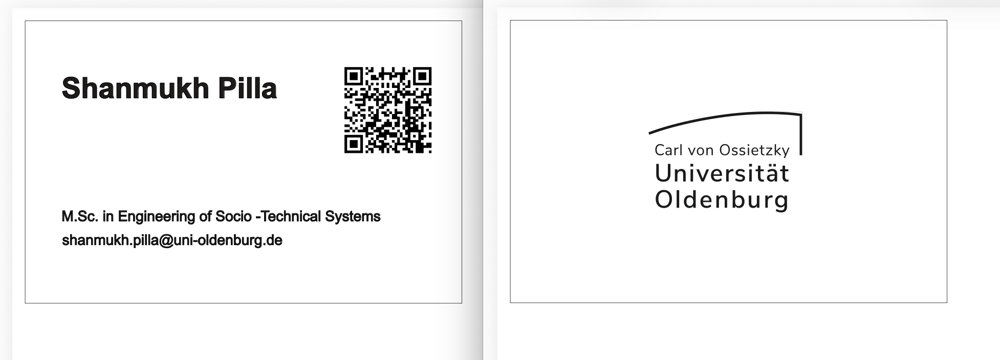
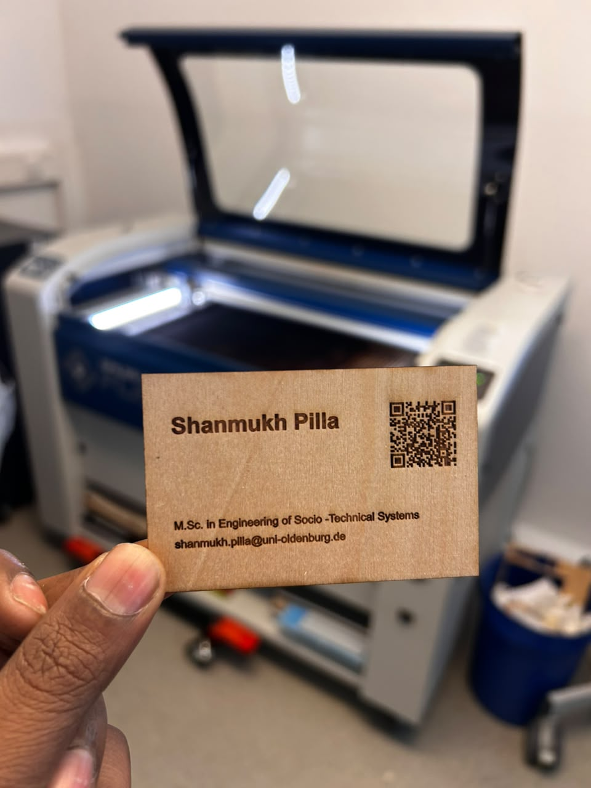
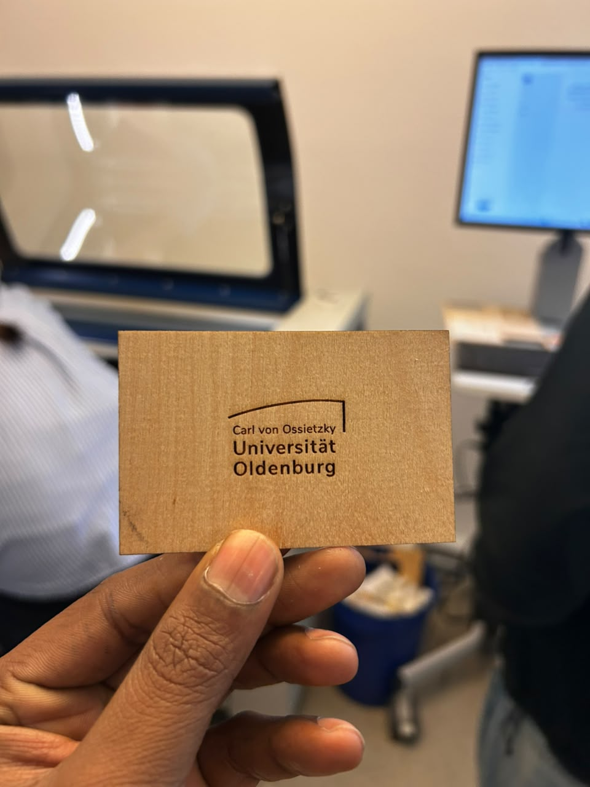

# Exercise 06 – Laser Cut Business Card

## Overview

This exercise focused on designing and fabricating a laser-cut business card using Inkscape and the Epilog laser cutter. The exercise introduced the complete workflow of laser fabrication, beginning with vector-based design and continuing through material selection, machine preparation, and the production of a finished physical object.

The exercise began with a laboratory workshop where the professor demonstrated the operation of the laser cutter, explained the differences between engraving and cutting, discussed the available fabrication materials, and introduced the safety procedures that must be followed while operating the machine. Observing the complete workflow before beginning my own design helped me understand how digital vector drawings are prepared and translated into accurately manufactured physical products.

For this exercise, I designed a simple and professional business card that represents my academic profile while also providing direct access to my Digital Design & Fabrication portfolio through a QR code. The following sections document the design process, fabrication workflow, observations, and reflections from completing this exercise.

---

# Design Process

The business card was designed in Inkscape by following the workflow introduced during the workshop. My initial design focused on presenting only the essential information, including my name, Master's programme and university email address. I intentionally kept the layout simple so that the information remained clear and easy to read after laser engraving.

While reviewing the design, I realised that the available space could be utilised more effectively. To improve the functionality of the card, I generated a QR code that links directly to my Digital Design & Fabrication GitHub portfolio and integrated it into the front side of the design.

I also decided to utilise the back of the business card by adding the Carl von Ossietzky Universität Oldenburg logo. This completed the overall appearance while maintaining the clean and minimal style that I originally intended.

Throughout the design process, several small adjustments were made to improve the positioning and spacing of the elements before preparing the final file for fabrication.

 

  

  <em>Figure 1: Final business card design prepared in Inkscape before laser fabrication.</em>

 

---

# Laser Fabrication

After completing the design, the artwork was exported according to the workshop requirements and prepared for laser cutting. From the available material options, I selected the wood-finish cardboard because its natural appearance complemented the minimal style of the business card.

Under the supervision of the professor, I observed the complete fabrication process while the laser cutter engraved the text, QR code and university logo before cutting the final outline of the business card. Watching the machine accurately reproduce the digital artwork demonstrated the precision of laser fabrication and reinforced the importance of preparing clean vector designs before manufacturing.

The fabrication process also highlighted the relationship between digital design and physical production, where the accuracy of the final product depends directly on the quality of the prepared artwork.

 

https://github.com/user-attachments/assets/front-side-laser-cut

  <em>Video 1: Laser engraving and cutting the front side of the business card.</em>

 

https://github.com/user-attachments/assets/back-side-laser-cut

  <em>Video 2: Laser engraving the back side of the business card.</em>

 

---

# Final Outcome

After fabrication, I received the completed wooden business card. The engraved text was sharp and clearly readable, the QR code scanned successfully and linked directly to my GitHub portfolio, and the university logo was accurately engraved on the back of the card.

Comparing the finished business card with the original Inkscape design showed that the final product closely matched the prepared artwork. The clean layout, together with the selected material, resulted in a professional-looking business card while preserving the simple design approach that I had planned from the beginning.

 

  
  

  <em>Figure 3: Completed laser-cut business card showing the front and back of the final design.</em>

 

---

# Observations

Throughout this exercise, I observed that the quality of the final laser-cut product depends heavily on the preparation of the digital design. Small adjustments to the layout, spacing and positioning of design elements contributed to a cleaner engraving result.

Observing the fabrication process also demonstrated how accurately the laser cutter reproduces vector graphics when the artwork is properly prepared. Material selection also influenced the final appearance of the business card, with the wood-finish cardboard providing a clean and professional finish that complemented the overall design.

The exercise further highlighted the importance of following the recommended fabrication workflow and safety procedures before operating laser manufacturing equipment.

---

# Reflection

This exercise provided practical experience in the complete laser fabrication workflow, from creating vector artwork in Inkscape to producing a finished physical product. Designing the business card encouraged me to think beyond the fabrication process itself and consider how layout, readability and functionality influence the overall quality of the final result.

Adding the QR code and utilising both sides of the business card were small design decisions that improved the usefulness of the finished product without compromising its simplicity. Observing the laser cutting process also strengthened my understanding of how digital vector drawings are accurately transformed into physical objects.

Overall, this exercise improved my confidence in preparing designs for laser fabrication and provided valuable experience in combining digital design, material selection and manufacturing into a complete fabrication workflow.