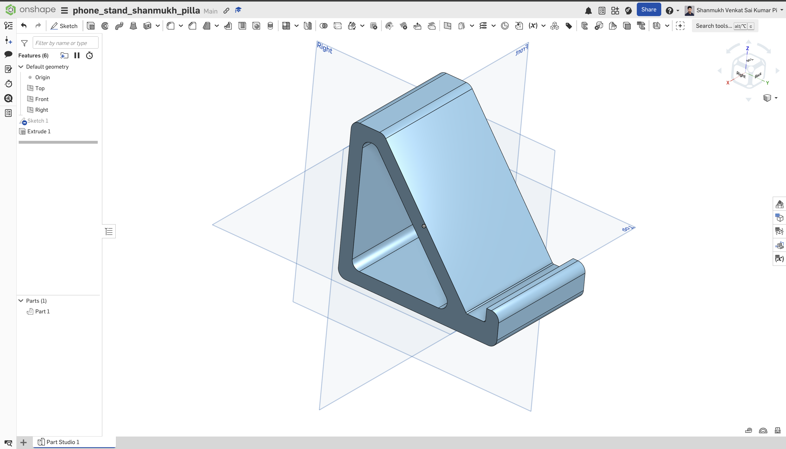
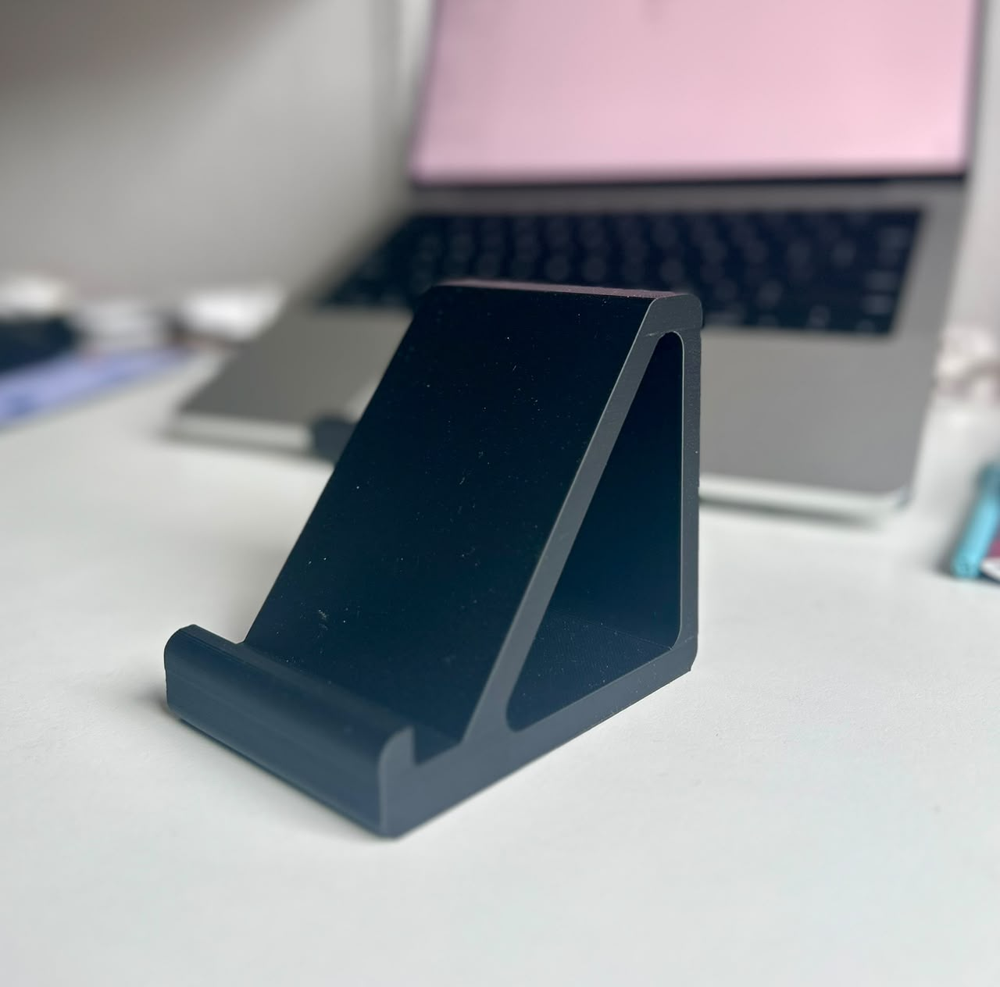

# Exercise 07: 3D Printing

## Overview

This exercise was about designing a simple phone stand using Onshape and preparing it for 3D printing. Before starting the design, I completed the required Onshape self-study modules. After finishing the model, I prepared it for 3D printing using QIDI Studio. Finally, I tested the printed phone stand using my phone and tablet.

---

## Onshape Self-Study

Before starting the design, I completed the required Onshape self-study modules. The training covered the basics of parametric CAD, sketching, and Part Studios. Since this was my first time using Onshape, the tutorials helped me understand the interface and the basic workflow before creating my own model.

 

<em>Figure 1: Completion of the required Onshape self-study modules.</em>

 

---

## Designing the Phone Stand

I decided to design a simple phone stand because I wanted something that I could use on my desk every day. I also wanted it to support both my phone and my tablet, so I made the stand slightly thicker for better stability. Since this was my first CAD model, I kept the design simple and improved it through a few iterations while learning how to use sketches, extrude, and fillet features.

 

<em>Figure 2: Final phone stand model created in Onshape.</em>

 

---

## Preparing the Model for Printing

After finishing the model, I prepared it for 3D printing using QIDI Studio. I used the default slicing settings and generated the print file without making any major changes. After checking the slicing preview, I submitted the file for printing..

 

<em>Figure 3: Slicing the model in QIDI Studio before printing.</em>

 

---

## Printed Model

The final printed model matched the CAD design well, and the overall print quality was good. It was nice to see the digital model become a physical object for the first time.

 

<em>Figure 4: Final 3D printed phone stand.</em>

 

---

## Testing the Printed Model

After receiving the printed model, I tested it using both my phone and my tablet. The stand supported both devices well and remained stable during normal use. The simple design worked as intended and was suitable for everyday use on a desk.

 

<em>Figure 5: Testing the printed stand with a phone and a tablet.</em>

 

---

## Reflection

This was my first experience using parametric CAD and preparing a model for 3D printing. At first, it took me some time to get familiar with the tools in Onshape, but after a few iterations the workflow became much easier.

Overall, this exercise gave me a good introduction to the complete process, from creating a CAD model to preparing it for printing and testing the final part. It also gave me more confidence to design similar models in the future.