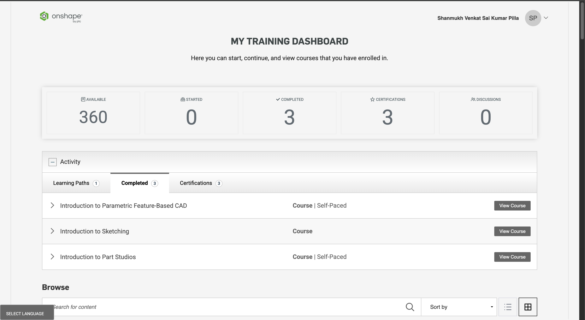
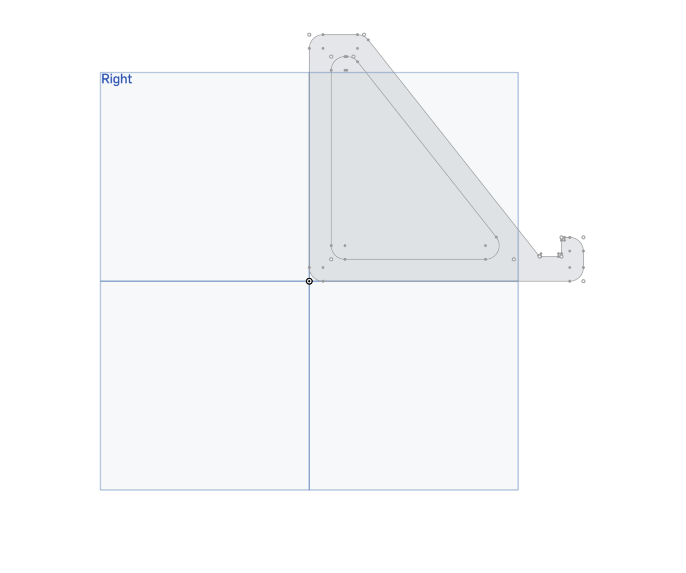
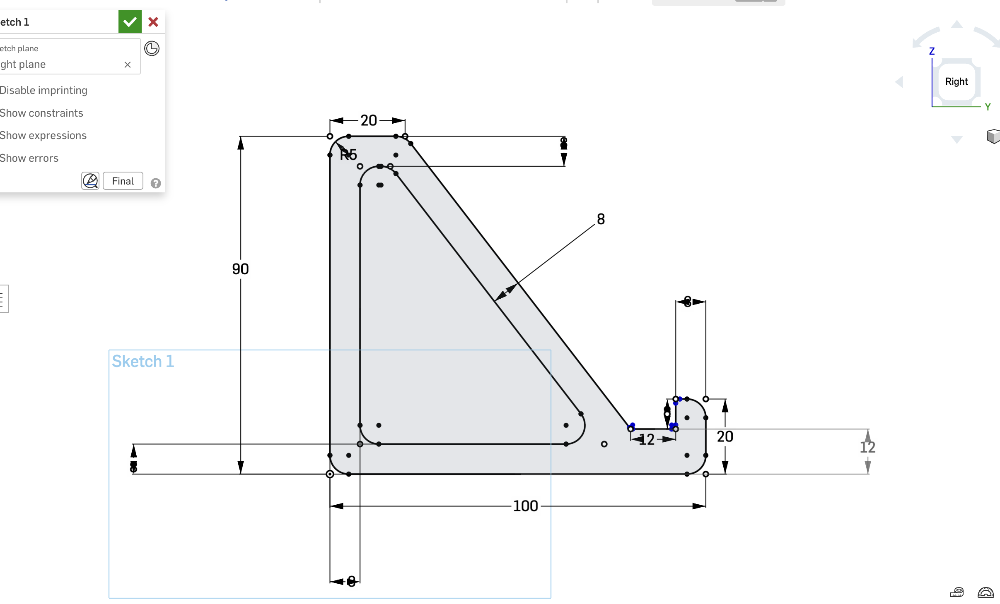
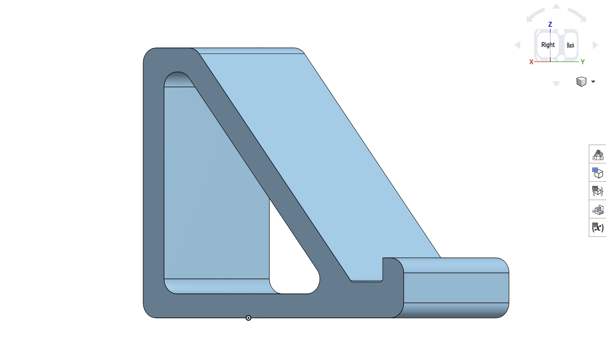
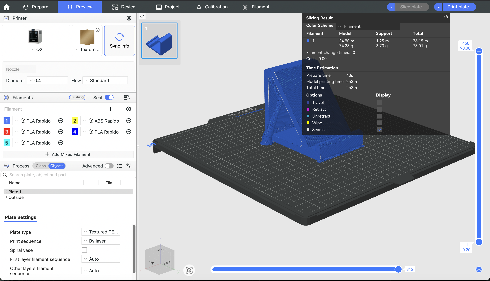
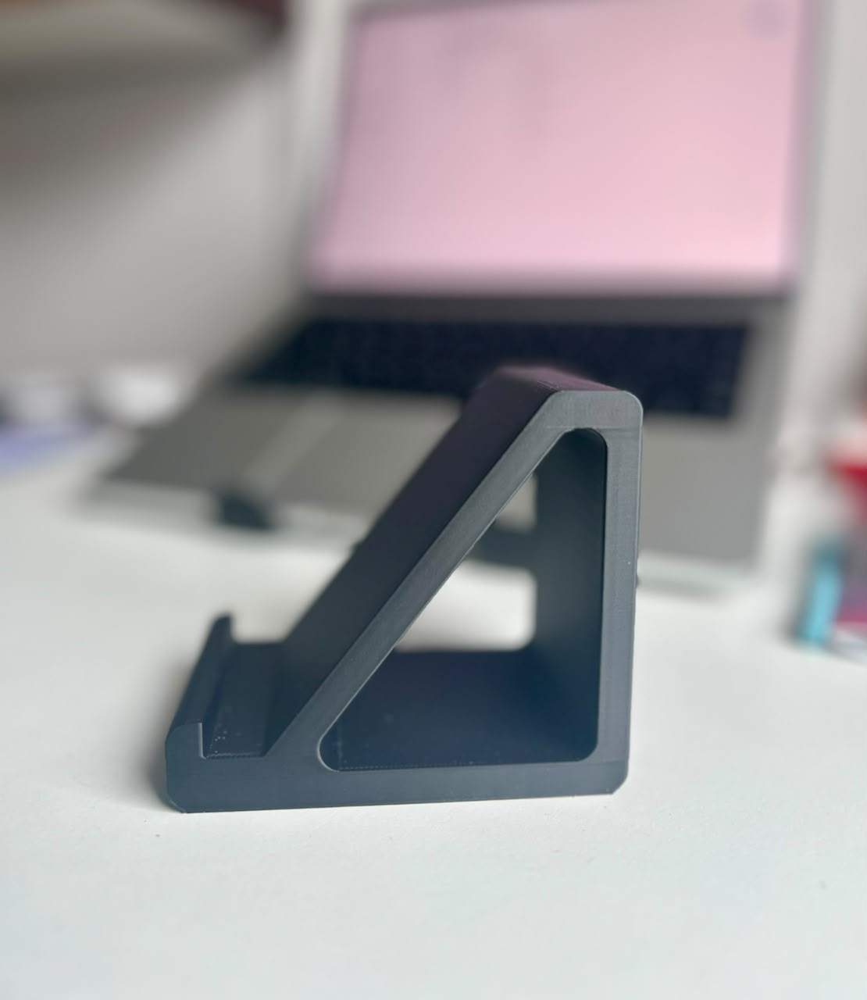
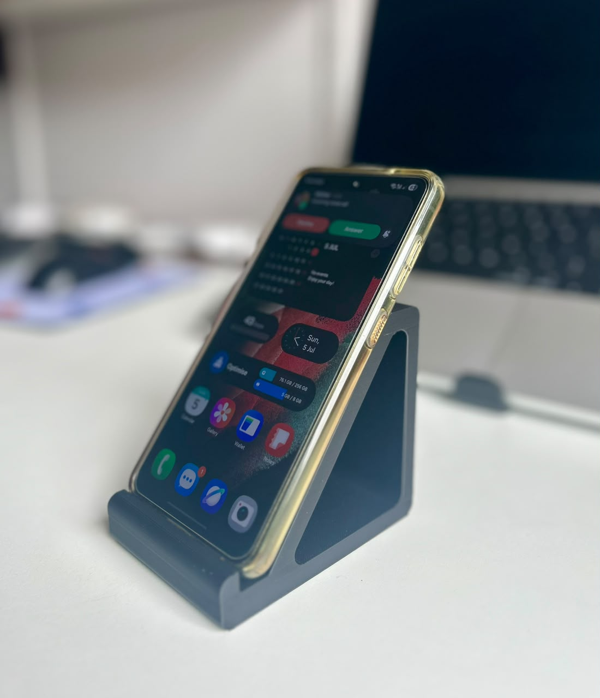
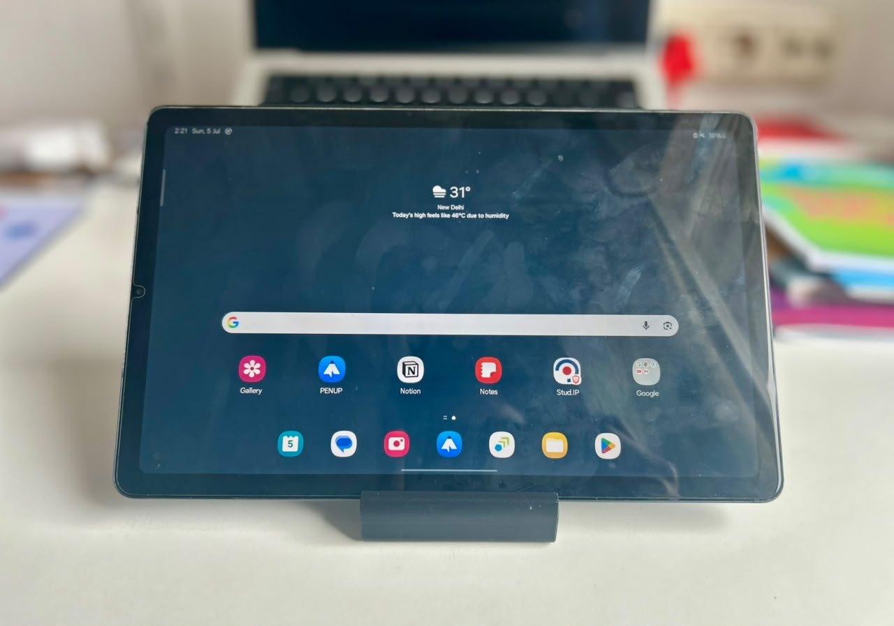
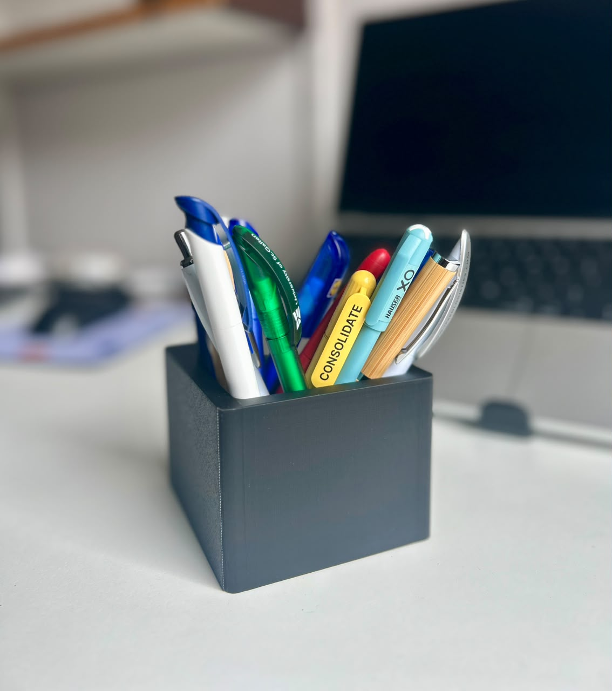

# Exercise 07: 3D Printing

## Overview

This exercise introduced the complete workflow of digital design and additive manufacturing, beginning with an introduction to parametric Computer-Aided Design (CAD) using Onshape and concluding with the design, preparation, and fabrication of a functional 3D printed accessory.

Prior to the laboratory exercise, a self-study activity was completed to become familiar with the fundamentals of parametric modelling and the Onshape cloud-based CAD platform. These introductory modules provided the foundation required to develop a custom design before preparing it for fabrication using slicing software and Fused Deposition Modelling (FDM) 3D printing.

Following the introductory training, I designed a compact desk accessory intended primarily as a phone stand while also serving as a simple pen holder when placed in an alternative orientation. The completed model was exported for manufacturing, prepared using QIDI Studio, and fabricated using the laboratory's 3D printing facilities.

This exercise provided my first practical experience of the complete engineering workflow—from developing an initial design concept, through CAD modelling and print preparation, to evaluating a manufactured prototype.

---

## Learning Parametric CAD with Onshape

Before beginning the design task, I completed the required Onshape self-study modules to gain a practical understanding of parametric CAD modelling. As this was my first experience using professional CAD software, the tutorials served as an important introduction to the design workflow that would later be applied throughout the exercise.

The training focused on three core areas:

- **Introduction to Parametric Feature-Based CAD**
- **Introduction to Sketching**
- **Introduction to Part Studios**

### Parametric Feature-Based CAD

This module introduced the principles of parametric, feature-based modelling and demonstrated how engineering models can be constructed using editable dimensions, geometric constraints, and sequential modelling features. Understanding this workflow highlighted one of the key advantages of parametric CAD: design modifications can be made efficiently without recreating the entire model.

### Sketching

The sketching module introduced the creation of two-dimensional profiles that serve as the foundation for three-dimensional models. It covered the use of dimensions, geometric constraints, and fully defined sketches, demonstrating how accurate sketch construction directly influences the quality and stability of the final CAD model.

### Part Studios

The final module introduced the Part Studio environment, where sketches are transformed into complete three-dimensional components using modelling operations such as Extrude, Revolve, Fillet, and Chamfer. This provided a practical understanding of how individual modelling features combine to produce manufacturable parts.

---

## Course Completion

The required Onshape learning modules were completed successfully before beginning the design exercise.

 

  

  <em>
    Figure 1: Completion of the required Onshape self-study modules.
  </em>

 

---

## Reflection

As this was my first experience with parametric CAD, the self-study modules provided an excellent introduction to a completely new design workflow. Although becoming familiar with the interface and modelling approach initially required time and practice, the tutorials were well structured and progressively introduced the concepts needed for the laboratory exercise.

Completing the training gave me sufficient confidence to begin designing my own model rather than simply following guided examples. More importantly, it helped me understand the underlying principles of parametric modelling, where designs are built through editable sketches, dimensions, and modelling features instead of static geometry. This foundation proved invaluable during the subsequent stages of concept development, iterative refinement, and preparation for 3D printing.

---

## Designing the 3D Printed Accessory

### Design Concept

Following the completion of the Onshape self-study, the next stage of the exercise was to design a small functional accessory suitable for additive manufacturing. The laboratory guidelines encouraged the development of a practical object that could be manufactured efficiently while remaining within the specified material constraints.

Rather than designing a purely decorative model, I wanted to create something that I could continue using after the exercise. Since I regularly work on my laptop while keeping my phone or tablet beside me, I decided to design a compact desk stand capable of supporting both devices. During the design process, I also realised that the same geometry could function as a simple pen holder when placed in a different orientation, adding a second practical use without increasing the complexity of the model.

This approach allowed me to focus on a clean, minimal design that addressed a genuine everyday requirement while remaining well suited for FDM 3D printing.

---

### From an Idea to a CAD Model

Although the final design appears relatively simple, arriving at the finished model required several iterations. Before modelling in Onshape, I explored different concepts by considering how the accessory would support the weight of a phone while maintaining sufficient stability and using as little material as possible.

Because this was my first experience developing a design with parametric CAD, translating an initial idea into a fully defined three-dimensional model was one of the most challenging aspects of the exercise. My early concepts did not provide the proportions or functionality that I was aiming for, so the design evolved gradually through a series of refinements rather than being completed in a single attempt.

As my understanding of Onshape improved, I became more confident in using sketches, dimensions and extrusion features to develop the model. One of the most valuable aspects of the parametric workflow was the ability to modify dimensions without rebuilding the entire design, making it much easier to experiment with different proportions before reaching the final geometry.

 

  
  

  <em>
    Figure 2: Early concept sketches and the evolution of the accessory design.
  </em>

 

---

### Design Development

As the design progressed, the focus shifted from simply creating a printable object to producing one that would be stable, practical and comfortable to use on a daily basis. Achieving this required several adjustments to the dimensions and proportions of the model.

One of the main challenges involved balancing the height, depth and supporting surfaces so that both a smartphone and a tablet could rest securely without compromising the overall stability of the stand. Small changes to one dimension frequently affected other parts of the model, requiring repeated adjustments before the overall geometry behaved as intended.

Although these iterations occasionally felt time-consuming, they demonstrated one of the major advantages of parametric CAD. Rather than recreating the model from the beginning, individual dimensions could be modified while preserving the overall design intent. As I became more familiar with the software, these revisions became increasingly efficient and significantly improved both the design process and the final result.

 

  

  <em>
    Figure 3: Development of the CAD model in Onshape before export for fabrication.
  </em>

 

---

### Preparing the Model for Fabrication

Once the final geometry had been completed, the model was exported from Onshape in both **STEP** and **STL** formats. The STEP file preserved the editable CAD model for future modifications, while the STL file generated the triangulated mesh required for additive manufacturing.

The STL model was then imported into **QIDI Studio**, where the final preparation for printing was completed. During this stage, the model orientation was adjusted and the slicing parameters were configured before generating the machine-readable **3MF** file used by the printer.

The software also provided estimates for print duration and filament consumption, allowing the model to be verified against the laboratory requirements before submission for fabrication.

 

  

  <em>
    Figure 4: Preparing the accessory for fabrication using QIDI Studio.
  </em>

 

### Slicing Configuration

To maximise printing stability, the model was positioned flat on the build plate, providing a large contact surface while minimising the need for support structures. This orientation also reduced the likelihood of print failure and improved the overall quality of the finished component.

Before exporting the print job, the estimated printing time and filament usage were reviewed to ensure that the accessory satisfied the material limitations specified for the exercise. After verifying the slicing configuration, the completed project was exported as a **3MF** file and submitted for printing.

---

## Printed Prototype

After the design files had been submitted, the accessory was fabricated using the laboratory's FDM 3D printer. Since the printing process was carried out separately during the laboratory session, the finished model was collected a few days later for evaluation.

Seeing the physical object for the first time was particularly rewarding because it marked the transition from a digital CAD model to a manufactured product. Until this point, the design had only existed within the CAD environment and slicing software. Holding the finished print demonstrated how the design decisions made throughout the modelling process directly influenced the dimensions, stability, and overall quality of the final component.

The printed accessory closely matched the original CAD model and showed that the digital workflow—from modelling and slicing to fabrication—had been successfully completed.

 

  
  

  <em>
    Figure 5: Completed 3D printed accessory after fabrication.
  </em>

 

---

## Functional Evaluation

The finished model was evaluated by testing it in the situations for which it had been designed. First, it was used as a smartphone stand, where it provided stable support while maintaining a comfortable viewing angle for everyday desk use.

The same accessory was then tested with a tablet to determine whether the design offered sufficient stability for a larger and heavier device. Despite the additional weight, the stand remained stable and successfully supported the tablet without noticeable deformation or loss of balance.

During testing, I also found that rotating the accessory into an alternative orientation allowed it to function as a simple pen holder. Although this was not the primary objective during the initial design stage, it became an additional practical feature of the final product without requiring any modifications to the geometry.

These evaluations demonstrated that the design successfully fulfilled its intended purpose while also providing an additional everyday use.

 

  
  

  <em>
    Figure 6: Evaluating the printed accessory as a phone and tablet stand.
  </em>

 

  

  <em>
    Figure 7: Alternative use of the accessory as a pen holder.
  </em>

 

---

## Observations

Testing the finished prototype demonstrated that even a relatively simple design benefits significantly from an iterative development process. Small adjustments made during modelling—particularly to the height, depth, and supporting surfaces—had a noticeable influence on the stability and usability of the final product.

The exercise also highlighted that successful additive manufacturing involves considerably more than producing a CAD model. Selecting an appropriate print orientation, preparing the model within the slicer, verifying material consumption, and considering manufacturability were all essential steps that contributed to the quality of the printed component.

More importantly, the exercise demonstrated the complete relationship between digital design and physical manufacturing. Every modelling decision made in the CAD environment was reflected directly in the finished product, reinforcing the importance of careful planning throughout the design process.

---

## Reflection

This exercise provided my first complete experience with the digital design and additive manufacturing workflow. Before this laboratory, I had no practical experience with parametric CAD or preparing models for 3D printing. Progressing from the introductory Onshape tutorials to designing a functional accessory, preparing it for fabrication, and finally evaluating the manufactured product provided valuable insight into the complete engineering design process.

One of the most valuable lessons was understanding that engineering design is inherently iterative. The final model was not produced in a single attempt; instead, it evolved through continuous refinement as I adjusted dimensions, evaluated stability, and simplified the geometry to improve both functionality and manufacturability.

The exercise also increased my confidence in using professional CAD software. Concepts that initially appeared unfamiliar—such as parametric sketches, feature-based modelling, and dimension-driven design—became increasingly intuitive through practice. Seeing the final printed accessory successfully perform its intended function made the entire development process particularly rewarding.

Overall, this exercise strengthened both my technical understanding of digital fabrication and my appreciation for the iterative nature of engineering design.

---

## Conclusion

This exercise successfully introduced the complete workflow of designing and manufacturing a functional 3D printed component. Beginning with introductory CAD training, progressing through concept development and parametric modelling, preparing the design using slicing software, and concluding with fabrication and functional evaluation provided a comprehensive understanding of modern additive manufacturing.

Beyond learning to use Onshape and QIDI Studio, the exercise strengthened my understanding of design iteration, manufacturability, and the relationship between digital models and physical products. It also demonstrated how a simple engineering concept can be refined into a practical and functional solution through systematic design, evaluation, and continuous improvement.

Overall, this exercise established a solid foundation in parametric CAD and 3D printing while providing practical experience of the complete engineering workflow from concept to manufactured product.

