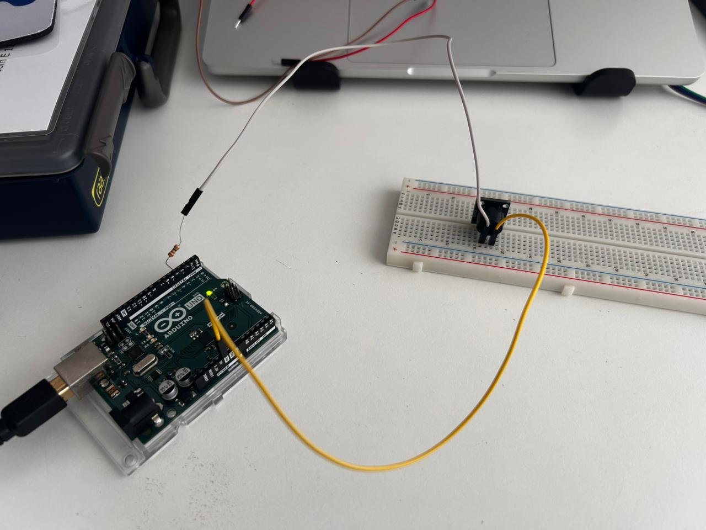
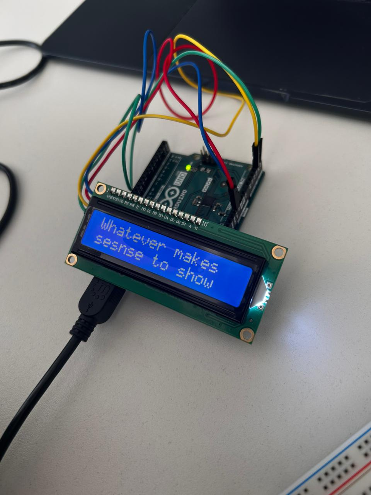
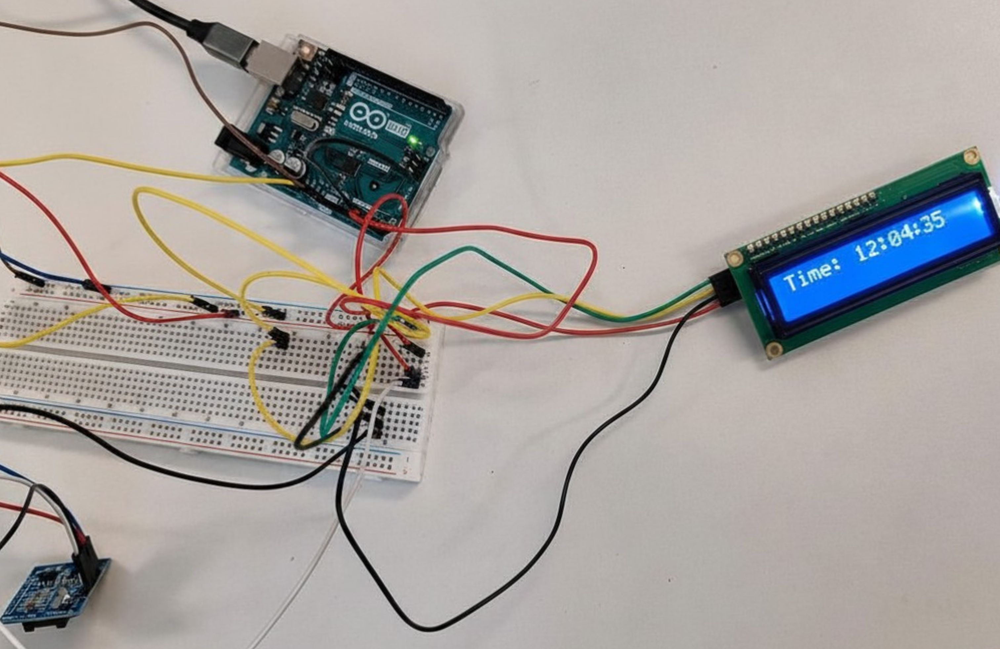
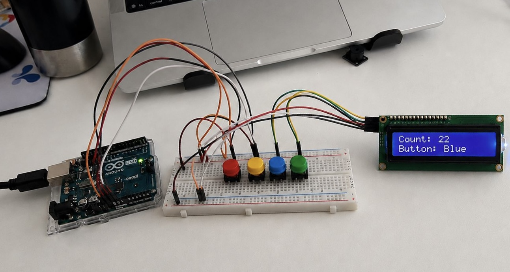
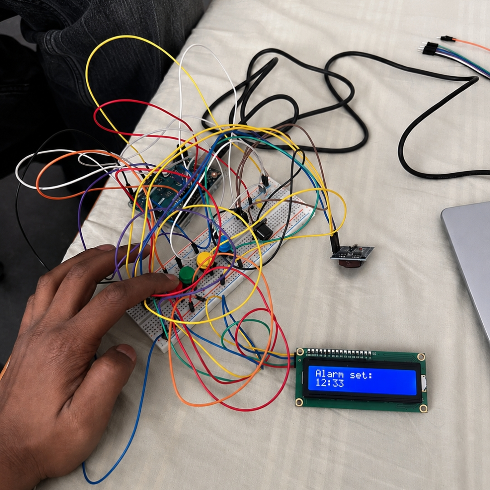
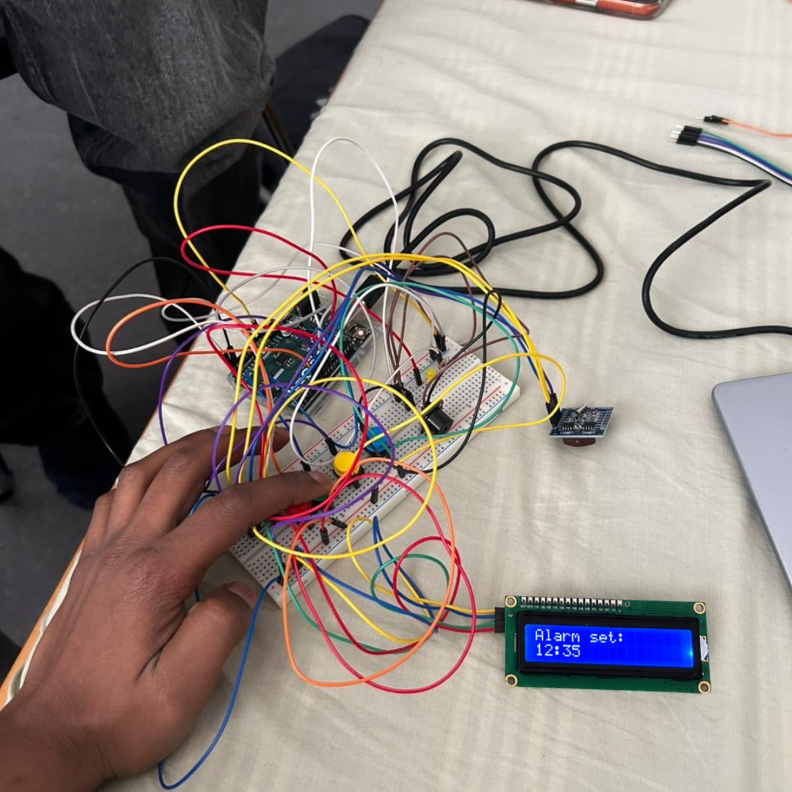
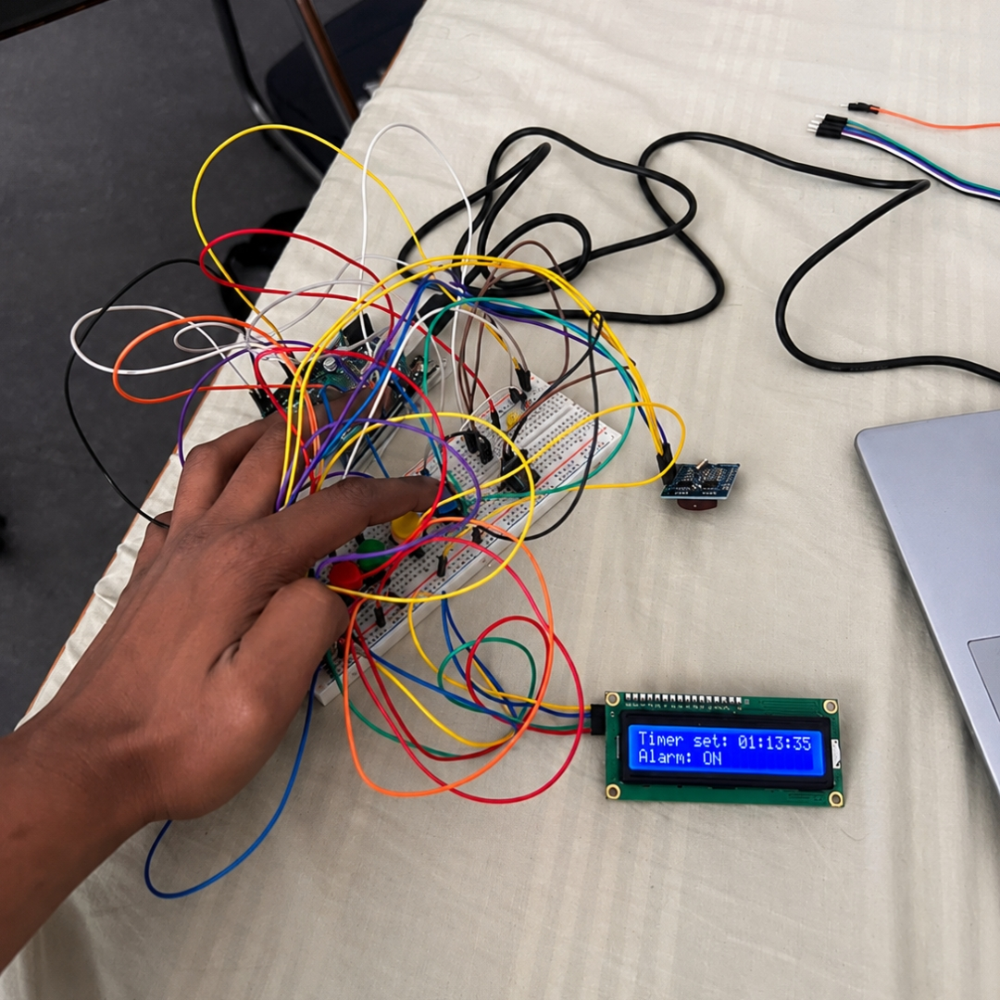
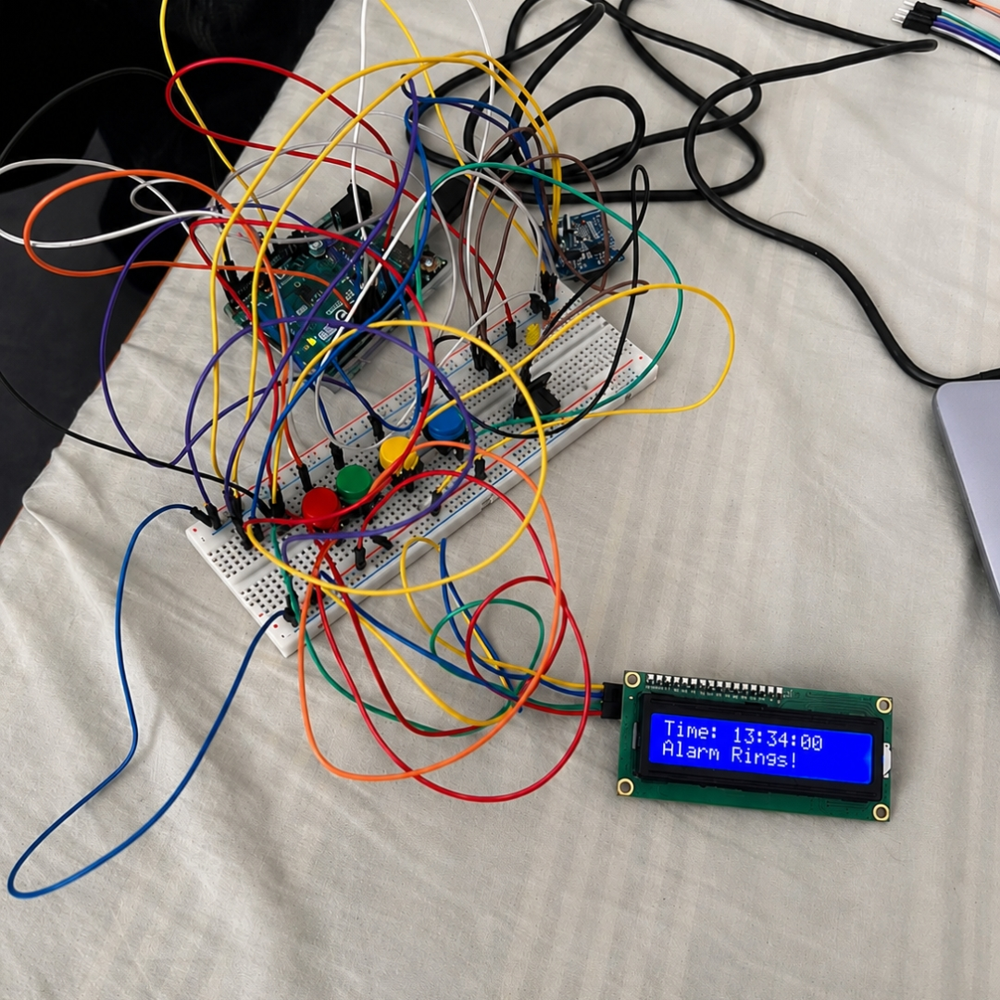

# Exercise 2: Introduction to Arduino

## Overview
This exercise introduced the fundamentals of Arduino-based prototyping through the development of a functional alarm clock system using multiple electronic components and communication interfaces. The objective of the exercise was to understand how microcontrollers interact with external hardware devices such as buzzers, LCD displays, real-time clock (RTC) modules, and push buttons to create an interactive embedded system.

Unlike the previous exercise, which focused mainly on passive electrical circuits and transistor-based switching, this exercise introduced programmable electronics using the Arduino Uno platform. Through assembling and testing different sub-circuits, I learned how software and hardware work together in embedded systems.

The exercise involved building and testing individual sub-circuits step-by-step before integrating them into a complete alarm clock system. Throughout the process, the circuits were assembled, programmed, debugged, and tested using the Arduino IDE, breadboard prototyping, and serial communication tools.

The following sections document the assembly process, observations, programming concepts, and reflections for each task.


---

# Sub-circuit 1 – Connecting the buzzer

## Objective
The objective of this task was to understand how a buzzer can be controlled using an Arduino Uno and digital output signals. This task introduced the basics of Arduino programming, digital HIGH and LOW states, and simple actuator control using a programmable microcontroller.

## Components Required
- Arduino Uno
- Buzzer
- Resistor
- Breadboard
- Male-male jumper wires

## Circuit Assembly
The circuit was assembled according to the provided schematic by connecting the buzzer to one of the Arduino digital output pins through a resistor. The Arduino was powered using the USB connection from the computer.

After assembling the circuit, the provided `buzzer_test.ino` sketch was uploaded using the Arduino IDE. Different delay values and timing sequences were tested to observe how the buzzer behaviour changes depending on the programmed delays.

Initially, understanding the Arduino pin configuration and uploading code to the board required careful setup and troubleshooting before the buzzer operated correctly.

<br>

<p align="center">
  
</p>

<p align="center">
  <em>
    Figure 1: Testing the buzzer circuit using Arduino Uno.
  </em>
</p>

<br>

## Observations
After uploading the test program, the buzzer successfully produced sound according to the programmed timing sequence. By modifying the delay values in the code, different beep intervals and sound patterns were observed.

It was observed that the Arduino digital output pins can directly control simple electronic actuators such as buzzers through HIGH and LOW output signals. The task also demonstrated how software timing directly influences hardware behaviour in embedded systems.

During testing, changing the delay duration produced noticeable differences in the speed and rhythm of the buzzer sound. The recorded video captured the buzzer behaviour while running the provided test code.

<br>

https://github.com/user-attachments/assets/068e5b70-0146-4c19-aabb-8d2d0d234a65

**Video 1:** Demonstration of buzzer behaviour using different delay timings in the provided Arduino test program.

<br>

## Reflection
This task provided my first practical experience with Arduino programming and digital actuator control. It also helped me understand how electronic components can be controlled programmatically using simple Arduino code and digital output signals.

Through testing different delay values and observing the buzzer behaviour, I also gained a better understanding of how timing functions influence hardware operation in embedded systems.

---

# Sub-circuit 2 – Connecting the LCD screen

## Objective
The objective of this task was to interface a 16x2 I2C LCD display with the Arduino Uno and observe how information and text can be displayed using I2C communication.

## Components Required
- Arduino Uno
- 16x2 I2C LCD Display
- Breadboard
- Male-male jumper wires

## Circuit Assembly
The LCD display was connected according to the provided schematic using the SDA and SCL communication pins of the Arduino Uno. Since the display communicates using the I2C protocol, only four connections were required: VCC, GND, SDA, and SCL.

After assembling the circuit, the LCD was tested to verify the display output. Initially, the display backlight turned ON, but no visible text appeared on the screen. After checking the circuit connections and testing the setup further, the display output became visible and the LCD operated correctly.

Further testing was then performed to display text on the LCD screen and understand how information can be shown using Arduino.

<br>

<p align="center">
  
</p>

<p align="center">
  <em>
    Figure 2: Testing text output on the LCD display.
  </em>
</p>

<br>

## Observations
During testing, the LCD successfully displayed text output correctly on the screen. This demonstrated how the Arduino communicates with the LCD using I2C communication.

It was observed that the LCD can display information clearly while using only minimal wiring connections through the I2C interface.

This task also provided practical understanding of LCD interfacing and display-based output systems in Arduino projects.

## Reflection
This task improved my understanding of I2C communication and LCD interfacing using Arduino. Testing the LCD display and observing the output helped me better understand how embedded systems can present information visually through display modules.

---

# Sub-circuit 3 – Expanding the setup with a Real Time Clock

## Objective
The objective of this task was to interface a Real Time Clock (RTC) module with the Arduino Uno and display the current time on the LCD screen using I2C communication.

## Components Required
- Arduino Uno
- RTC Module
- 16x2 I2C LCD Display
- Breadboard
- Male-male jumper wires

## Circuit Assembly
The RTC module was connected according to the provided schematic using the SDA and SCL communication pins of the Arduino Uno. Since both the LCD display and RTC module use I2C communication, they shared the same communication lines while operating together in the circuit.

After assembling the circuit, the RTC module was tested and connected successfully with the LCD display. The current time stored in the RTC module was then displayed on the LCD screen through the Arduino setup.

<br>

<p align="center">
  
</p>

<p align="center">
  <em>
    Figure 3: Displaying the current time on the LCD using the RTC module.
  </em>
</p>

<br>

## Observations
During testing, the RTC module successfully communicated with the Arduino and displayed the current time on the LCD screen. It was observed that both the LCD display and RTC module could operate together using the same I2C communication lines.

This task also demonstrated how the RTC module can continuously maintain and provide real-time information for embedded system applications.

## Reflection
This task improved my understanding of RTC modules, I2C communication, and multi-device interfacing using Arduino. Observing the real-time clock output on the LCD helped me better understand how embedded systems process and display time-based information.

---

# Sub-circuit 4 – Using the Push Button

## Objective
The objective of this task was to interface push buttons with the Arduino Uno and understand how button inputs can be detected using digital input pins and pull-up resistor configurations.

## Components Required
- Arduino Uno
- Push Buttons
- 16x2 I2C LCD Display
- Breadboard
- Male-male jumper wires
- LEDs

## Circuit Assembly
The push buttons were connected to the Arduino Uno according to the provided schematic using digital input pins. The circuit was assembled on a breadboard together with LEDs and the LCD display to observe button interaction and system response.

During the setup, the buttons were tested using Arduino input readings to detect button presses correctly. The LCD display was also integrated into the setup to visually observe the button interaction and display corresponding output information.

<br>

<p align="center">
  
</p>

<p align="center">
  <em>
    Figure 4: Testing push button inputs using Arduino and displaying button interaction on the LCD screen.
  </em>
</p>

<br>

## Observations
During testing, the push buttons successfully interacted with the Arduino system and the corresponding output was displayed on the LCD screen. It was observed that the Arduino could detect button presses through digital input signals and respond accordingly.

The LEDs and LCD display helped in visually confirming the behaviour of the push buttons during interaction.

This task also introduced the practical usage of pull-up resistor configurations for stable button input detection in Arduino-based systems.

## Reflection
This task improved my understanding of digital input handling, push button interfacing, and user interaction in embedded systems. Testing the push buttons together with the LCD display helped me better understand how Arduino systems can process and respond to external user inputs.

---

# Building a Functional Arduino Alarm Clock

## Objective
The objective of this final task was to integrate all previously tested sub-circuits into a complete functional alarm clock system using Arduino Uno.

The system was designed to:
- Display the current time using the RTC module
- Allow alarm time configuration using push buttons
- Enable and disable the alarm without modifying the code
- Trigger a buzzer alarm when the configured time matches the RTC time
- Display all system states and interactions on the LCD screen

This final task combined multiple electronic components, embedded programming concepts, and user interaction into a single functional embedded system.

---

## Components Used
- Arduino Uno
- RTC DS1307 Module
- 16x2 I2C LCD Display
- Push Buttons
- Buzzer
- Breadboard
- Male-male jumper wires

---

## Circuit Integration
The complete alarm clock system was assembled by integrating the RTC module, LCD display, buzzer, and push buttons into a single Arduino-based setup.

The RTC module continuously provided real-time clock data to the Arduino through the I2C communication interface. The LCD display was used to display the current time, alarm configuration, and alarm status messages.

The push buttons were configured for different alarm operations:
- **Red Button** → Open alarm setup menu
- **Green Button** → Increase alarm minutes
- **Blue Button** → Enable the alarm
- **Final Alarm State** → Trigger buzzer and display alarm notification

The Arduino continuously monitored the RTC time and compared it with the configured alarm time. When both values matched, the buzzer was activated and the LCD displayed the alarm notification.

---

# Alarm Clock Functionalities

## 1. Opening the Alarm Setup Menu
Pressing the red button opened the alarm setup interface on the LCD display.

Example LCD Output:
```text
Alarm set:
12:33
```

<br>

<p align="center">
  
</p>

<p align="center">
  <em>
    Figure 5: Opening the alarm setup menu using the red push button.
  </em>
</p>

<br>

---

## 2. Increasing Alarm Minutes
Pressing the green button increased the configured alarm minute value.

Example LCD Output:
```text
Alarm set:
12:35
```

<br>

<p align="center">
  
</p>

<p align="center">
  <em>
    Figure 6: Increasing the alarm minute value using the green push button.
  </em>
</p>

<br>

---

## 3. Activating the Alarm
Pressing the blue button enabled the configured alarm.

Example LCD Output:
```text
Time: 13:34:00
Alarm is ON
```

<br>

<p align="center">
  
</p>

<p align="center">
  <em>
    Figure 7: Activating the configured alarm using the blue push button.
  </em>
</p>

<br>

---

## 4. Alarm Trigger
When the RTC time matched the configured alarm time, the buzzer was activated and the LCD displayed the alarm notification.

Example LCD Output:
```text
Time: 13:34:00
Alarm Rings!
```

<br>

<p align="center">
  
</p>

<p align="center">
  <em>
    Figure 8: Alarm activation when the configured alarm time matches the RTC time.
  </em>
</p>

<br>

---

## Observations
During testing, the alarm clock system successfully performed all required operations:
- Real-time clock monitoring
- Alarm configuration using push buttons
- LCD-based system feedback
- Alarm activation and buzzer triggering

The project demonstrated successful integration of multiple electronic devices using Arduino and showed how embedded systems can process real-time information while responding to user interaction.

It was also observed that combining RTC communication, button inputs, LCD output, and actuator control into a single system requires careful hardware wiring and structured program logic.

---

## Reflection
This final task provided practical experience in designing and implementing a complete embedded system using Arduino.

Through this project, I improved my understanding of:
- Real-time embedded programming
- Multi-component hardware integration
- LCD communication using I2C
- RTC interfacing
- Push button input handling
- Alarm logic implementation
- Embedded system debugging and testing

The exercise also demonstrated how individual electronic modules can be combined to create a fully interactive and functional real-world application.

---

## Conclusion
The final alarm clock system successfully integrated all sub-circuit functionalities into a single embedded application capable of displaying time, configuring alarms, and triggering notifications automatically.

This exercise strengthened practical knowledge of Arduino programming, hardware interfacing, real-time systems, and interactive embedded design. It also provided hands-on experience in developing a complete prototype by combining sensors, displays, user inputs, and output devices into one functional system.
