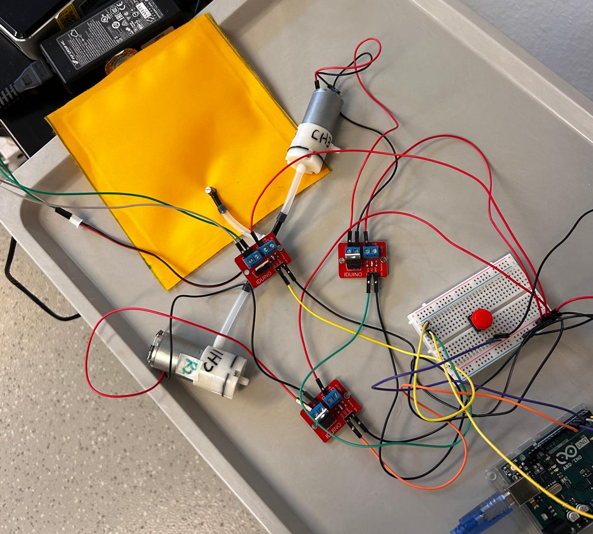
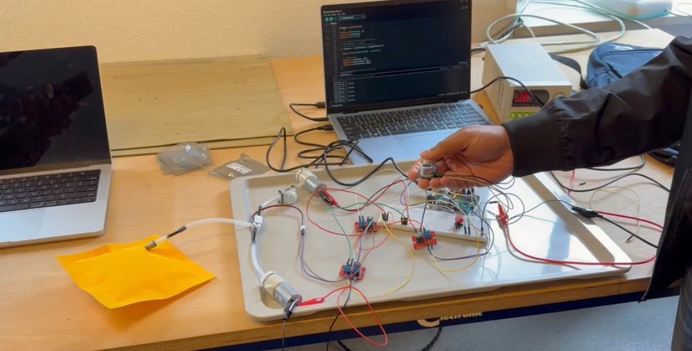
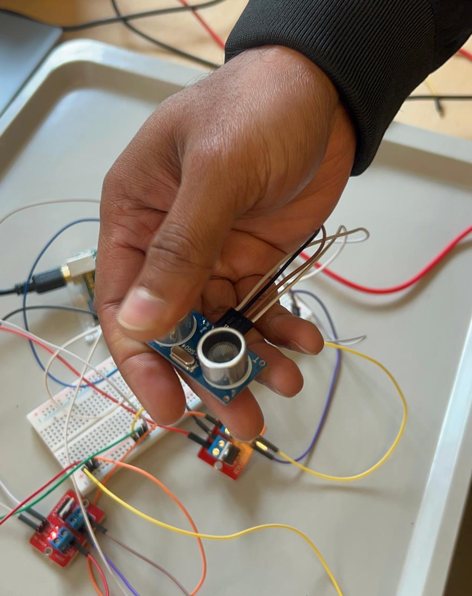

# Exercise 3: Sensors & Actuators

## Overview

This exercise focused on combining sensors, actuators, and Arduino programming to create an interactive pneumatic system. The goal was to build a working pneumatic circuit consisting of two air pumps, one air valve, and an inflatable pillow, and then develop a sensor-driven interaction that could control the inflation and deflation behaviour of the system.

Unlike the previous exercise, which focused primarily on displaying information and responding to user inputs through buttons, this exercise introduced physical actuation. The system was capable of performing real-world actions by moving air through a pneumatic circuit and changing the state of an inflatable pillow.

The exercise was divided into two parts:

- **Part A – Pneumatic & Electrical Circuit**
- **Part B – Sensor Interaction**

The first part focused on assembling and debugging the actuator system, while the second part involved integrating an ultrasonic sensor and designing an interactive control method for inflation and deflation.

Throughout the exercise, I assembled the circuits, programmed the Arduino, tested actuator behaviour, resolved pneumatic issues, and finally combined both parts into a fully functional interactive system.

---

# Part A – Pneumatic & Electrical Circuit

## Objective

The objective of this part was to assemble and test a pneumatic actuation system using two air pumps, one air valve, and three MOSFET driver modules controlled by an Arduino Uno.

The final goal was to create a system capable of both inflating and deflating an inflatable pillow before introducing any sensor-based control.

## Components Required

- Arduino Uno
- 2 × Air Pumps
- 1 × Air Valve
- 3 × IRF520 MOSFET Driver Modules
- Laboratory Power Supply
- Breadboard
- Jumper Wires
- Silicone Tubing
- Inflatable Air Pillow

## Circuit Assembly

The first step involved assembling the electrical control circuit.

Each actuator (two pumps and one valve) was connected to an individual IRF520 MOSFET module, allowing the Arduino to safely switch the higher-current pneumatic components. The pumps and valve were powered using the laboratory power supply, while the Arduino remained powered through USB.

After completing the wiring, I uploaded a test program that activated the pumps and valve sequentially. The built-in status LEDs on the MOSFET modules were used to verify that the switching signals were being generated correctly.

Once the electrical circuit was functioning, I assembled the pneumatic circuit using silicone tubing and connected the inflatable pillow to the system.

 

  

  <em>
    Figure 1: Initial assembly of the pneumatic and electrical circuit.
  </em>

 

## Initial Testing and Challenges

During the first round of testing, the system did not behave as expected.

The inflation pump successfully inflated the pillow, indicating that the electrical circuit and actuator control were functioning correctly. However, the pillow could not be deflated even when the deflation sequence was activated through the program.

Initially, I suspected that the issue originated from the Arduino code or MOSFET switching logic. After checking the software and verifying the actuator outputs, it became clear that the problem was related to the pneumatic configuration rather than the control program itself.

Several iterations were required to understand the airflow routing through the valve and tubing arrangement. During this process, assistance from the supervisor helped identify mistakes in the pneumatic setup and improve my understanding of how the valve switches airflow between inflation and deflation paths.

After correcting the tubing arrangement and refining the actuator sequence, the system successfully performed both inflation and deflation.

 

https://github.com/user-attachments/assets/e74a0b01-6992-41c2-a799-c6a28ad7f51d

**Video 1:** Initial testing stage where inflation worked correctly but deflation was unsuccessful.

 

## Final Working Pneumatic System

After troubleshooting and several hardware adjustments, the complete pneumatic system operated correctly.

The final behaviour included:

- Successful pillow inflation
- Successful pillow deflation
- Reliable switching between airflow paths
- Repeated operation through Arduino control

The successful implementation demonstrated the importance of understanding both electrical control and pneumatic behaviour when developing actuator-based systems.

 

https://github.com/user-attachments/assets/4935137f-9744-493e-a18f-b1f9d33a074b

**Video 2:** Successful inflation and deflation after resolving pneumatic configuration issues.

 

## Observations

During testing, I observed that electrical functionality alone does not guarantee correct system behaviour. Although the pumps and valve were receiving the correct control signals, the overall operation depended heavily on the pneumatic configuration.

The built-in LEDs on the MOSFET modules proved useful for debugging because they allowed me to verify that switching signals were reaching the actuators correctly.

This stage also highlighted the importance of systematic troubleshooting by isolating hardware and software components during debugging.

## Reflection

This part of the exercise significantly improved my understanding of actuator control, MOSFET switching, and pneumatic systems.

The troubleshooting process was particularly valuable because it demonstrated how embedded systems often require debugging across multiple domains, including electronics, software, and mechanical systems.

Learning how to identify and resolve the inflation-deflation issue provided practical experience that cannot be obtained through theory alone.

---

# Part B – Sensor Interaction

## Objective

The objective of this part was to transform the pneumatic system into an interactive device by integrating a sensor and using sensor readings to control the inflation and deflation behaviour automatically.

Rather than using manual buttons, the goal was to create a more intuitive interaction between the user and the pneumatic system.

## Sensor Selection

For this task, I selected an ultrasonic distance sensor.

Typically, ultrasonic sensors are used for measuring distance. However, instead of simply displaying measured values, I wanted to explore how the sensor could be used as an interaction mechanism for controlling the inflatable pillow.

The idea was to create a simple gesture-based control method that could trigger different pneumatic actions.

## Sensor Integration

The ultrasonic sensor was first connected and tested independently using Arduino example programs.

After verifying that the sensor was functioning correctly, it was integrated into the existing pneumatic control system.

The Arduino program was then modified so that specific interactions with the ultrasonic sensor controlled the actuator behaviour.

The pneumatic system was connected to the inflatable pillow and tested repeatedly to ensure stable operation during inflation and deflation.

 

  

  <em>
    Figure 2: Integration of the ultrasonic sensor with the pneumatic control system.
  </em>

 

## Interactive Behaviour

Once both subsystems were combined, the ultrasonic sensor became the primary method of controlling the inflatable pillow.

Rather than using the sensor in the conventional way for measuring distance, I experimented with a more interactive control approach. The ultrasonic sensor contains two circular transducer elements, and these were used as separate interaction zones.

The final interaction was designed as follows:

- Completely covering one side of the ultrasonic sensor activated the inflation sequence.
- Completely covering the opposite side activated the deflation sequence.
- The Arduino detected these changes and triggered the corresponding pneumatic action.
- The inflatable pillow responded immediately by either expanding or contracting.

This approach transformed the ultrasonic sensor from a simple distance-measuring device into a gesture-based control interface. Instead of continuously monitoring distance values, the system interpreted user interaction with different parts of the sensor to determine which action should be executed.

This design made the pneumatic system more intuitive and interactive while also demonstrating how sensors can be repurposed creatively beyond their typical applications.

 

  

  <em>
    Figure 3: Interactive control of inflation and deflation by covering different sides of the ultrasonic sensor.
  </em>

 

**Video 3:** Demonstration of the final interactive system where different sides of the ultrasonic sensor control inflation and deflation of the pneumatic pillow.

 

## Observations

The ultrasonic sensor provided an effective and responsive method for controlling the pneumatic system.

One of the most interesting outcomes was that the sensor was not used in its traditional distance-measurement role. Instead, different regions of the sensor were used as interaction zones that triggered different pneumatic actions.

This demonstrated how standard electronic components can be creatively adapted for alternative forms of user interaction. By simply covering different sides of the sensor, the user could control the inflation and deflation behaviour of the pillow without requiring physical buttons or switches.

The exercise demonstrated how sensors and actuators can work together to create interactive embedded systems that bridge digital sensing and physical motion.

## Reflection

This part of the exercise improved my understanding of sensor integration, interaction design, and real-time control systems.

By combining sensor readings with actuator outputs, I gained practical experience in developing responsive systems that react to user behaviour.

The exercise also encouraged creative thinking by exploring alternative uses for standard electronic components beyond their typical applications.

---

# Overall Conclusion

This exercise successfully combined sensing, actuation, programming, and system integration into a single interactive project.

Through building the pneumatic control system, troubleshooting inflation and deflation issues, and integrating an ultrasonic sensor, I gained valuable practical experience with embedded system development.

One of the most important lessons from this exercise was that successful system behaviour depends on the interaction between hardware, software, and physical mechanisms. Debugging required careful testing of all three areas, reinforcing the importance of iterative development and systematic problem-solving.

The final system successfully demonstrated how sensor inputs can control physical actuators in real time, creating an interactive pneumatic device capable of inflating and deflating an air-filled pillow.

Overall, this exercise was both challenging and rewarding, providing hands-on experience in building responsive embedded systems that combine sensing and physical actuation.
